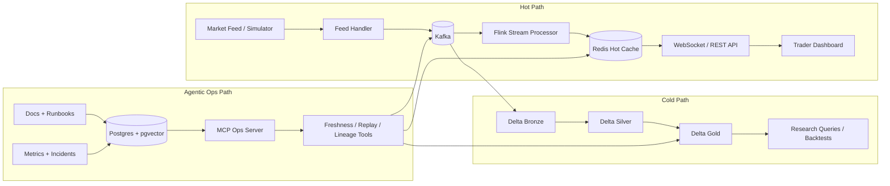

# Low-Latency Market Data & Research Platform

The project is organized around three paths:

- Hot path: ingest, process, cache, and serve live market data with low latency.
- Cold path: persist raw and curated history for replay, research, and backtesting.
- Agentic ops path: expose controlled reliability tools through MCP with RAG-backed context.

## Target Architecture



## Repository Map

| Path | Purpose |
| --- | --- |
| `services/feed-simulator` | Generates synthetic exchange-style market events for local and replay workflows. |
| `services/feed-handler` | Normalizes raw feed messages, validates sequence numbers, and publishes canonical events. |
| `services/stream-processor` | Owns Flink jobs for top-of-book, bars, rolling metrics, freshness, and alerts. |
| `services/market-data-api` | Serves Redis-backed live state through WebSocket and REST APIs. |
| `services/mcp-ops-server` | Exposes controlled MCP tools for reliability diagnostics and replay operations. |
| `apps/trader-dashboard` | Frontend for live market state, latency, charts, and alerts. |
| `lakehouse` | Databricks, Delta Lake, Spark jobs, and bronze/silver/gold table design. |
| `contracts` | Versioned event schemas, Kafka topic contracts, and API payload contracts. |
| `infra` | Local dependency stack, Kubernetes notes, and cloud infrastructure placeholders. |
| `observability` | OpenTelemetry, metrics, dashboards, alerts, and SLO definitions. |
| `docs` | Architecture, operational model, decisions, and roadmap. |

## First Build Milestones

1. Define canonical market data contracts and Kafka topic boundaries.
2. Implement feed simulator and feed handler with sequence validation.
3. Add Flink stream jobs for top-of-book, rolling bars, and freshness metrics.
4. Serve hot state from Redis through WebSocket APIs.
5. Land raw and curated datasets into Databricks Delta tables.
6. Add MCP tools for freshness checks, replay dry-runs, and lineage lookup.
7. Add dashboard views for live state, latency, alerts, and service health.

## Local POC Demo

Step 0 and step 1 are implemented as a Docker Compose POC.

Prerequisites:

- Docker with Compose support.
- Python virtual environment at `.venv` for local tests and service runs outside Docker.

Set up local Python dependencies:

```bash
python3 -m venv .venv
.venv/bin/python -m pip install --upgrade pip setuptools wheel
.venv/bin/python -m pip install -e '.[dev]'
```

Start the stack:

```bash
./scripts/run-local-demo.sh
```

Then open:

- Dashboard: `http://localhost:8000`
- API health: `http://localhost:8000/health`
- Latest symbol snapshot: `http://localhost:8000/latest/AAPL`

Local flow:

```text
feed simulator -> feed handler -> Redpanda topics -> stream processor -> Redis -> FastAPI/WebSocket -> dashboard
```

The simulator injects occasional sequence gaps. The feed handler publishes those as `market.quality.alerts.v1`; the stream processor stores recent alerts in Redis so the dashboard can surface them.

### Databento Real-Feed Demo

The current default data source is synthetic. To drive the same dashboard with Databento, set `DATABENTO_API_KEY` and run the Databento profile:

```bash
export DATABENTO_API_KEY='db-...'
export DATABENTO_TIMEOUT_SECONDS='120'
docker compose -f infra/docker-compose.yml --profile databento up --build redpanda redis feed-handler stream-processor market-data-api databento-feed
```

Open `http://localhost:8000`. The full setup and low-cost replay options are in `docs/databento-demo.md`.

Stop the stack:

```bash
docker compose -f infra/docker-compose.yml down
```

Run unit and contract tests:

```bash
.venv/bin/python -m pytest tests/unit
```

## MVP Stateful Streaming

Iteration 2 adds a Flink job in `services/stream-processor/flink` for stateful market calculations. The default demo still uses the Python fallback processor so the POC remains easy to run. Use the Flink profile when Docker can build the Java job image:

```bash
./scripts/run-mvp-flink.sh
```

The Flink job publishes:

- `market.state.top_of_book.v1`
- `market.bars.1s.v1`
- `market.metrics.rolling.v1`
- `market.quality.alerts.v1`

It writes Redis hot state under the keys documented in `contracts/redis/keys.md`.

Rebuild Redis from derived Kafka topics:

```bash
.venv/bin/python -m market_platform.tools.rebuild_redis_from_kafka --dry-run
```

Run deterministic stream-output tests:

```bash
.venv/bin/python -m pytest tests/integration
```

Run the local API load test after the stack is live:

```bash
.venv/bin/python scripts/load-test-local.py --symbol AAPL --requests 500 --concurrency 25
```

Benchmark setup and current known limits are tracked in `docs/performance.md`.

## Cold Path Lakehouse

Iteration 3 adds Databricks Delta cold-path assets under `lakehouse`:

- Machine-readable Delta table contracts in `lakehouse/contracts/tables.yml`.
- Databricks Asset Bundle jobs in `lakehouse/databricks/bundle.yml`.
- Spark jobs for bronze ingest, silver normalization, gold features, quality reports, and replay dry-runs in `lakehouse/jobs`.
- A research notebook example in `lakehouse/notebooks/research_backtest_example.py`.
- Local transformation tests for bronze, silver, and gold table behavior.

The cold path is replay/research infrastructure only. The live API continues to read Redis hot state and does not query Databricks.

Validate local cold-path code and contracts:

```bash
.venv/bin/python -m pytest tests/unit/test_lakehouse_transforms.py tests/unit/test_lakehouse_contracts.py
```

When the Databricks CLI is available, validate/deploy the bundle from `lakehouse/databricks`:

```bash
databricks bundle validate -t dev
databricks bundle deploy -t dev
```

## Agentic Ops And Obsidian RAG

Iteration 4 adds a read-only MCP-style ops layer with RAG evidence over repo docs and Obsidian notes.

Start the ops server:

```bash
.venv/bin/python -m market_platform.services.mcp_ops_server
```

Index an Obsidian vault and repo docs:

```bash
.venv/bin/python -m market_platform.tools.index_obsidian ~/ObsidianVault --source-type obsidian --json-store var/rag/vector-store.json
.venv/bin/python -m market_platform.tools.index_obsidian docs contracts lakehouse --source-type docs --json-store var/rag/vector-store.json
```

The production-shaped vector store is Postgres + pgvector using `infra/postgres/pgvector.sql`. Tools include freshness checks, sequence-gap explanations, replay dry-runs, live-vs-replay comparison, incident summaries, and lineage lookup.

More examples are in `docs/mcp-examples.md` and `docs/obsidian-rag.md`.

## Production Readiness

Iteration 5 adds production-facing assets:

- GitHub Actions CI for linting, tests, contract/artifact validation, Docker builds, and Flink Maven packaging.
- Container image mapping in `infra/images`.
- Kubernetes Kustomize manifests in `infra/kubernetes`.
- GCP deployment target and Terraform scaffolding in `infra/gcp` and `infra/terraform`.
- Secret management guidance in `infra/secrets`.
- Grafana dashboard, alert rules, structured log schema, and OpenTelemetry collector config in `observability`.
- Runbooks and backup/recovery docs under `docs`.

Validate production artifacts locally:

```bash
.venv/bin/python scripts/validate-production-artifacts.py
```

Full production status and remaining runtime gates are tracked in `docs/production-readiness.md`.

## Positioning

This is a data platform project, not a trading strategy project. It shows quant data infrastructure skills across streaming, lakehouse design, observability, replay, and controlled agentic operations.
