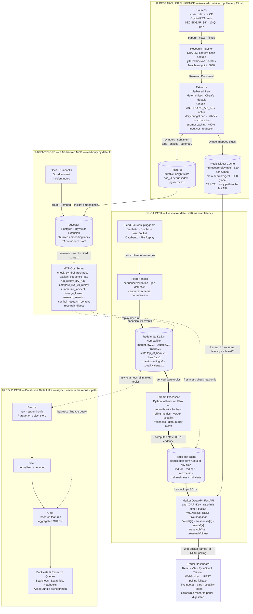

# Low-Latency Market Data & Research Platform

A quant data-infrastructure platform that ingests live market data, processes it with stateful
streaming, serves it with sub-20 ms API latency, persists it into a Delta lakehouse for
replay and backtesting, enriches it with structured research intelligence, and operates itself
through controlled, RAG-backed agentic tools.

This is a **data platform project, not a trading strategy project** — it demonstrates
streaming, lakehouse design, observability, replay, LLM-assisted research extraction, and
controlled agentic operations.

---

## Table of Contents

- [System at a Glance](#system-at-a-glance)
- [How Data Flows](#how-data-flows)
- [Repository Map](#repository-map)
- [Quick Start](#quick-start)
- [Layer 1 — Hot Path](#layer-1--hot-path)
- [Layer 2 — Cold Path Lakehouse](#layer-2--cold-path-lakehouse)
- [Layer 3 — Research Intelligence](#layer-3--research-intelligence)
- [Layer 4 — Agentic Ops](#layer-4--agentic-ops)
- [Trader Dashboard](#trader-dashboard)
- [API Reference](#api-reference)
- [Deployment](#deployment)
- [Observability & Operations](#observability--operations)
- [Development & Testing](#development--testing)
- [Performance](#performance)
- [Design Principles](#design-principles)
- [Documentation Index](#documentation-index)

---

## System at a Glance

Four integrated layers, each independently deployable and isolated by design:

| Layer | Role | Latency profile | Failure blast radius |
| --- | --- | --- | --- |
| 🔴 **Hot path** | Ingest → process → cache → serve live market data | Sub-20 ms reads | Core — protected by contracts, alerts, freshness SLOs |
| 🟡 **Cold path** | Persist raw + curated history in Delta Lake | Batch | None on live serving — API never queries the lakehouse |
| 🟢 **Research intelligence** | arXiv / RSS / EDGAR → structured insights | Poll loop (15 min default) | None — isolated container, Redis-cached reads only |
| 🔵 **Agentic ops** | Controlled MCP reliability tools with RAG evidence | Interactive | Read-only diagnostics; replays are dry-run by default |


```mermaid
flowchart TD

    subgraph HOT["🔴  HOT PATH — live market data · &lt;20 ms read latency"]
        direction LR

        FEEDS["Feed Sources  pluggable<br/>Synthetic · Coinbase WebSocket<br/>Databento · File Replay"]

        FH["Feed Handler<br/>sequence validation · gap detection<br/>canonical schema normalization"]

        RDP[("Redpanda  Kafka-compatible<br/>market.raw.v1 · .quotes.v1 · .trades.v1<br/>.state.top_of_book.v1 · .bars.1s.v1<br/>.metrics.rolling.v1 · .quality.alerts.v1")]

        SPROC["Stream Processor<br/>Python fallback  or  Flink job<br/>top-of-book · 1-s bars<br/>rolling metrics · VWAP · volatility<br/>freshness · data-quality alerts"]

        HRED[("Redis  hot cache<br/>rebuildable from Kafka at any time<br/>md:tob · md:bar · md:metrics<br/>md:freshness · md:alerts")]

        APIV["Market Data API  FastAPI<br/>auth X-API-Key · rate-limit token-bucket<br/>WS /ws/live  REST /live/snapshot<br/>/latest/{s} · /freshness/{s} · /alerts/{s}<br/>/research/{s} · /research/digest"]

        FEEDS -->|"raw exchange messages"| FH
        FH ==>|"canonical v1 events"| RDP
        RDP ==>|"derived-state topics"| SPROC
        SPROC ==>|"computed state  0.5 s cadence"| HRED
        HRED ==>|"key lookup  &lt;20 ms"| APIV
    end

    UI["Trader Dashboard<br/>React · Vite · TypeScript · Tailwind<br/>WebSocket → REST polling fallback<br/>live quotes · bars · volatility · alerts<br/>collapsible research panel · digest tab"]

    APIV ==>|"WebSocket frames  or  REST polling"| UI

    subgraph COLD["🟡  COLD PATH — Databricks Delta Lake — async · never in the request path"]
        direction LR

        BRNZ["Bronze<br/>raw · append-only<br/>Parquet on object store"]
        SLVR["Silver<br/>normalized · deduped"]
        GOLD["Gold<br/>research features<br/>aggregated OHLCV"]
        BTST["Backtests &amp; Research Queries<br/>Spark jobs · Databricks notebooks<br/>Asset Bundle orchestration"]

        BRNZ --> SLVR --> GOLD --> BTST
    end

    RDP -.->|"async fan-out  all market topics"| BRNZ

    subgraph RESEARCH["🟢  RESEARCH INTELLIGENCE — isolated container · poll every 15 min"]
        direction LR

        RSRC["Sources<br/>arXiv  q-fin · cs.CE<br/>Crypto RSS feeds<br/>SEC EDGAR  8-K · 10-Q · 10-K"]

        RING["Research Ingestor<br/>SHA-256 content-hash dedupe<br/>jittered backoff 30–90 s<br/>health endpoint :8030"]

        REXT["Extractor<br/>rule-based  free · deterministic · CI-safe  default<br/>Claude  ANTHROPIC_API_KEY  opt-in<br/>daily budget cap · fallback on exhaustion<br/>prompt caching  ~90% input cost reduction"]

        PG[("Postgres<br/>durable insight store<br/>doc_id dedup index · pgvector ext")]

        RDIG[("Redis Digest Cache<br/>md:research:{symbol}  ≤10 per symbol<br/>md:research:digest    ≤20 global<br/>24 h TTL · only path to the hot API")]

        RSRC -->|"papers · news · filings"| RING
        RING -->|"ResearchDocument"| REXT
        REXT -->|"symbols · sentiment<br/>tags · entities · summary"| PG
        REXT -->|"symbol-mapped digest"| RDIG
    end

    RDIG -->|"/research/* — same latency as /latest/*"| APIV

    subgraph OPS["🔵  AGENTIC OPS — RAG-backed MCP — read-only by default"]
        direction LR

        ODOC["Docs · Runbooks<br/>Obsidian vault<br/>Incident notes"]

        VEC[("pgvector<br/>Postgres + pgvector extension<br/>chunked embedding index<br/>RAG evidence store")]

        MCP["MCP Ops Server<br/>check_symbol_freshness · explain_sequence_gap<br/>run_replay_dry_run · compare_live_vs_replay<br/>summarize_incident · lineage_lookup<br/>research_search · symbol_research_context<br/>research_digest"]

        ODOC -->|"chunk + embed"| VEC
        PG -->|"insight embeddings"| VEC
        VEC -->|"semantic search · cited context"| MCP
    end

    MCP -.->|"freshness check  read-only"| HRED
    MCP -.->|"replay dry-run"| RDP
    MCP -.->|"backtest · lineage query"| GOLD
```

---

## How Data Flows

### Hot path: a market event, end to end

1. **Feed** — a pluggable source (`market_platform/feeds/`: synthetic, Coinbase WebSocket,
   Databento, or deterministic file replay) emits raw exchange-style messages.
2. **Feed handler** — normalizes raw messages into canonical, versioned events
   (`contracts/events/*.schema.json`), validates sequence numbers, distinguishes feed-session
   restarts from genuine gaps, and publishes detected gaps to `market.quality.alerts.v1`.
3. **Kafka / Redpanda** — durable, replayable topic boundaries (`contracts/topics.md`):
   raw → trades/quotes → derived state.
4. **Stream processor** — stateful computation of top-of-book, 1-second bars, rolling
   metrics (VWAP, volatility), and per-symbol freshness. Two interchangeable
   implementations: a Python fallback (default, zero-build demo) and a Flink job
   (`services/stream-processor/flink`, `--profile flink`) that publishes identical
   contracted topics.
5. **Redis hot cache** — the *only* store the live API reads. Keys are contracted in
   `contracts/redis/keys.md` and can be rebuilt at any time from Kafka derived topics
   (`market_platform.tools.rebuild_redis_from_kafka`).
6. **Market data API** — FastAPI service serving WebSocket frames (`/ws/live`) with REST
   polling fallback (`/live/snapshot`) for hosts without WebSocket support, plus per-symbol
   snapshot, freshness, alert, and research endpoints.
7. **Trader dashboard** — React/Vite/TypeScript UI (with a no-build static fallback)
   showing live quotes, spreads, bars, volatility, freshness, alerts, and research insights.

### Cold path: durable history

Kafka topics land into Delta **bronze** (raw, append-only) → **silver** (normalized,
deduplicated) → **gold** (research-ready features) via Spark jobs in `lakehouse/jobs`,
orchestrated by Databricks Asset Bundles. The cold path is replay/research infrastructure
only — the live API never queries it.

### Research intelligence: documents → insights

The `research-ingestor` polls arXiv (q-fin/cs.CE), crypto news RSS, and SEC EDGAR on a
configurable loop, deduplicates by content hash, extracts structured insights
(summary, symbols, tags, sentiment, entities) using a rule-based extractor (default, free,
deterministic) or Claude (opt-in, budget-capped), persists to Postgres, and refreshes a
Redis digest cache (`md:research:*`, 24 h TTL). The API and dashboard read **only the Redis
cache** — Postgres and the LLM are never in the request path.

### Agentic ops: evidence-backed diagnostics

Repo docs, runbooks, Obsidian notes, and research insights are indexed into Postgres +
pgvector. The MCP ops server exposes controlled, read-only-by-default tools — freshness
checks, sequence-gap explanations, replay dry-runs, live-vs-replay comparison, incident
summaries, lineage lookup, and research search — each answering with citations from the
evidence store.

---

## Repository Map

| Path | Purpose |
| --- | --- |
| `market_platform/feeds/` | Pluggable feed sources: synthetic, Coinbase, Databento, file replay. |
| `market_platform/services/feed_handler/` | Normalization, sequence validation, canonical event publishing. |
| `market_platform/services/stream_processor/` | Python fallback stream processor (top-of-book, bars, metrics, freshness, alerts). |
| `services/stream-processor/flink/` | Flink/Java stateful streaming job (same output contracts as the Python fallback). |
| `market_platform/services/market_data_api/` | FastAPI WebSocket/REST API reading Redis hot state. |
| `market_platform/services/research_ingestor/` | Research poll loop: fetch → dedupe → extract → store → refresh Redis digest. |
| `market_platform/research/` | Research pipeline internals: sources, extractors, models, store, symbol map. |
| `market_platform/services/mcp_ops_server/` | Controlled MCP tools for reliability diagnostics and research context. |
| `apps/trader-dashboard/` | React/Vite/TypeScript dashboard (`src/`) with static no-build fallback (`static/`). |
| `lakehouse/` | Delta table contracts, Databricks bundles, Spark bronze/silver/gold jobs, notebooks. |
| `contracts/` | Versioned schemas: events, topics, Redis keys, API payloads, research documents/insights, MCP tools. |
| `infra/` | Docker Compose stack, Dockerfiles, Kubernetes Kustomize, Terraform/GCP, secrets guidance. |
| `observability/` | Metrics definitions, Grafana dashboard, alert rules, OTel collector config, log schema. |
| `scripts/` | Demo launchers, load test, health wait, production artifact validator. |
| `docs/` | Architecture, runbooks, decisions, deployment guides, performance, roadmap. |
| `tests/` | Unit, contract, and integration tests (deterministic, no network required). |

---

## Quick Start

### Prerequisites

- Docker with Compose support (for the full stack).
- Python 3.11+ virtual environment for tests and running services outside Docker:

```bash
python3 -m venv .venv
.venv/bin/python -m pip install --upgrade pip setuptools wheel
.venv/bin/python -m pip install -e '.[dev]'
```

### Option A — full local stack (Docker)

```bash
./scripts/run-local-demo.sh
```

Then open:

- Dashboard: `http://localhost:8000`
- API health: `http://localhost:8000/health`
- Latest snapshot: `http://localhost:8000/latest/AAPL`

Stop the stack:

```bash
docker compose -f infra/docker-compose.yml down
```

### Option B — dashboard only, no Docker

Seeded demo data, no Redis or Kafka required:

```bash
MARKET_DATA_DEMO_MODE=1 .venv/bin/python -m market_platform.services.market_data_api
```

### Option C — verify everything with tests

```bash
.venv/bin/python -m pytest          # all unit + contract + integration tests
.venv/bin/python -m ruff check .    # lint
.venv/bin/python scripts/validate-production-artifacts.py
```


---

## Layer 1 — Hot Path

### Feed sources

The feed layer is pluggable (`market_platform/feeds/`). All sources emit the same canonical
events, so everything downstream is source-agnostic:

| Source | Profile | Keys required | Use case |
| --- | --- | --- | --- |
| Synthetic simulator | (default) | none | Local dev, CI, deterministic demos |
| File replay | `replay` | none | Deterministic e2e CI smoke tests |
| Coinbase WebSocket | `coinbase` | none | Free live crypto quotes (`docs/coinbase-demo.md`) |
| Databento | `databento` | `DATABENTO_API_KEY` | Real equities/futures feed (`docs/databento-demo.md`) |

Live Databento example:

```bash
export DATABENTO_API_KEY='db-...'
docker compose -f infra/docker-compose.yml --profile databento up --build \
  redpanda redis feed-handler stream-processor market-data-api databento-feed
```

### Data-quality handling

The simulator runs clean by default. To demo gap detection, set
`SIMULATOR_SEQUENCE_GAP_PROBABILITY=0.03` before starting the stack — the feed handler
publishes detected gaps to `market.quality.alerts.v1` and the dashboard surfaces them.
A large backward sequence jump is treated as a feed-session restart rather than a gap
(threshold: `SEQUENCE_RESTART_RESET_THRESHOLD=1000`).

### Stream processing

The default demo uses the Python fallback processor for zero-build startup. The Flink job
is the production-shaped implementation:

```bash
./scripts/run-mvp-flink.sh
```

Both publish the same contracted topics —
`market.state.top_of_book.v1`, `market.bars.1s.v1`, `market.metrics.rolling.v1`,
`market.quality.alerts.v1` — and write Redis keys per `contracts/redis/keys.md`.

### Redis as rebuildable cache

Redis is a cache, not a source of truth. Rebuild it from Kafka derived topics at any time:

```bash
.venv/bin/python -m market_platform.tools.rebuild_redis_from_kafka --dry-run
```

---

## Layer 2 — Cold Path Lakehouse

Delta Lake assets live under `lakehouse/`:

- **Contracts** — machine-readable Delta table definitions in `lakehouse/contracts/tables.yml`.
- **Jobs** — Spark jobs for bronze ingest, silver normalization, gold features, quality
  reports, and replay dry-runs in `lakehouse/jobs`.
- **Orchestration** — Databricks Asset Bundle in `lakehouse/databricks/bundle.yml`.
- **Research** — example backtest notebook in `lakehouse/notebooks/`.

Bronze/silver/gold transformations are tested locally without a Databricks workspace:

```bash
.venv/bin/python -m pytest tests/unit/test_lakehouse_transforms.py tests/unit/test_lakehouse_contracts.py
```

Deploy with the Databricks CLI:

```bash
cd lakehouse/databricks
databricks bundle validate -t dev
databricks bundle deploy -t dev
```

---

## Layer 3 — Research Intelligence

A QuantMind-style pipeline that turns papers, news, and filings into structured,
symbol-mapped insights — built as a **cold-path service that never touches the hot path**.

### Pipeline

```text
arXiv / RSS / EDGAR → research-ingestor (poll, dedupe by content hash)
                    → extractor (rule-based | Claude, budget-capped)
                    → Postgres (durable) + pgvector (searchable)
                    → Redis digest cache (md:research:*, 24 h TTL)
                    → REST API + dashboard + MCP tools
```

### Key properties

- **Dual extraction** — the rule-based extractor is free, deterministic, and the default;
  the Claude extractor is opt-in via `ANTHROPIC_API_KEY` with a hard daily budget cap
  (`RESEARCH_LLM_DAILY_BUDGET_USD`) that falls back to rule-based on exhaustion.
- **Hot-path isolation** — the API reads only the Redis digest cache; Postgres and the LLM
  are never in the request path, so `/research/{symbol}` has the same latency profile as
  `/latest/{symbol}` and works in Vercel demo mode.
- **Crash isolation** — the ingestor runs as its own container; it can fail with zero
  impact on quotes and trades.
- **Determinism for CI** — a committed fixture (`market_platform/fixtures/research-sample.jsonl`)
  drives the replay profile with no keys and no network.

### Run it

Offline from the fixture:

```bash
docker compose -f infra/docker-compose.yml --profile research-replay run --rm --build research-replay
curl http://localhost:8000/research/BTC-USD
```

Live (arXiv + RSS, keyless):

```bash
docker compose -f infra/docker-compose.yml --profile research up --build
```

Quick start, configuration reference, and the LLM cost table: `docs/research-intelligence.md`.
Architecture decisions: `docs/decisions/research-intelligence.md`.

---

## Layer 4 — Agentic Ops

A read-only MCP-style ops layer with RAG evidence over repo docs, runbooks, and Obsidian
notes — every answer cites its sources.

Start the ops server:

```bash
.venv/bin/python -m market_platform.services.mcp_ops_server
```

Index evidence (Obsidian vault + repo docs):

```bash
.venv/bin/python -m market_platform.tools.index_obsidian "obsidian/Market Data Research Vault" --source-type obsidian --json-store var/rag/vector-store.json
.venv/bin/python -m market_platform.tools.index_obsidian docs contracts lakehouse --source-type docs --json-store var/rag/vector-store.json
```

### Tools

| Tool | What it does |
| --- | --- |
| `check_symbol_freshness` | Per-symbol staleness diagnosis with SLO context |
| `explain_sequence_gap` | Root-cause context for gap alerts from runbooks |
| `run_replay_dry_run` | Validates a replay plan without executing it |
| `compare_live_vs_replay` | Diffs live state against replayed state |
| `summarize_incident` | RAG summary across incident notes |
| `lineage_lookup` | Topic/table lineage from contracts |
| `research_search` | Semantic search over extracted research insights |
| `symbol_research_context` | Market metrics + research citations in one answer |
| `research_digest` | Latest cross-symbol insights, filtered by time window |

The production-shaped vector store is Postgres + pgvector (`infra/postgres/pgvector.sql`);
a JSON file store backs local development. Examples: `docs/mcp-examples.md`,
`docs/obsidian-rag.md`.

---

## Trader Dashboard

Two implementations, one API:

- **React** (`apps/trader-dashboard/src/`) — Vite + React 18 + TypeScript + Tailwind.
  Typed hooks (`useLiveData` for WebSocket→polling fallback, `useResearch` for the 60 s
  digest poll), tab navigation (Watchlist | Research), per-symbol collapsible research
  panels, bid/ask price-flash animations, and a connection badge.
- **Static fallback** (`apps/trader-dashboard/static/`) — zero-build vanilla JS with the
  same functionality, served whenever the React build is absent.

```bash
cd apps/trader-dashboard
npm install
npm run dev      # Vite dev server on :5173, proxying to the API on :8000
npm run build    # outputs dist/ — FastAPI serves it automatically at /
```

The dashboard also includes an `Open Obsidian` action wired to the repo-local vault.

---

## API Reference

All endpoints support optional API-key auth (`X-API-Key` header or `?api_key=`) with
per-key token-bucket rate limiting when `API_KEYS` is configured.

| Endpoint | Purpose |
| --- | --- |
| `GET /health` | Liveness + Redis ping |
| `GET /symbols` | Active symbol set |
| `GET /latest/{symbol}` | Full snapshot: quote, top-of-book, bar, metrics, freshness, alerts |
| `GET /freshness/{symbol}` | Freshness lag and staleness status |
| `GET /alerts/{symbol}` | Recent data-quality alerts |
| `GET /live/snapshot` | One live frame over REST (WebSocket-free hosts, e.g. Vercel) |
| `WS /ws/live` | Streaming live frames (0.5 s cadence, connection-capped) |
| `GET /research/digest` | Latest cross-symbol research insights (Redis, ≤20) |
| `GET /research/{symbol}` | Research insights for one symbol (Redis, ≤10) |
| `GET /obsidian/project` | Obsidian vault link metadata |

---

## Deployment

### Docker Compose profiles

| Profile | Adds | Used for |
| --- | --- | --- |
| (none) | redpanda, redis, postgres, feed-simulator, feed-handler, stream-processor, market-data-api, mcp-ops-server, otel-collector | Default local stack |
| `flink` | Flink jobmanager + taskmanager | Production-shaped stream processing |
| `coinbase` | Coinbase WebSocket feed | Free live crypto data |
| `replay` | Deterministic file-replay feed | CI e2e smoke |
| `databento` | Databento live feed | Real market data |
| `research` | Research ingestor (live arXiv/RSS) | Research intelligence |
| `research-replay` | One-shot fixture-driven ingestor | CI research assertion |

### Cloud

- **Kubernetes** — Kustomize base + GCP overlay in `infra/kubernetes` (includes Flink
  deployment manifests).
- **Terraform / GCP** — scaffolding in `infra/terraform` and `infra/gcp`;
  `.terraform.lock.hcl` is committed to pin providers.
- **Vercel** — one-click dashboard + API hosting with custom-domain setup; serverless-safe
  (lazy Redis init, REST polling instead of WebSockets). Guide: `docs/vercel-deployment.md`.
- **Secrets** — management guidance in `infra/secrets`.

---

## Observability & Operations

- **Metrics** — definitions in `observability/metrics.yml`; Grafana dashboard included.
- **Alerts** — rules for hot-path freshness/gaps and research-pipeline staleness
  (`observability/alerts/research-alerts.yml`).
- **Tracing/Logs** — OpenTelemetry collector config and structured log schema in `observability/`.
- **Runbooks** — operational procedures in `docs/runbooks/` (e.g. `research-ingest-stalled.md`).
- **SLO posture** — freshness is a first-class signal: every symbol carries
  `freshness_lag_ms` and a `fresh`/`stale` status end-to-end, from stream processor to
  dashboard badge.

---

## Development & Testing

```bash
.venv/bin/python -m pytest tests/unit          # unit + contract tests
.venv/bin/python -m pytest tests/integration   # deterministic stream-output tests
.venv/bin/python -m ruff check .               # lint
.venv/bin/python scripts/validate-production-artifacts.py
```

CI (GitHub Actions, `.github/workflows/ci.yml`) runs four jobs on every push/PR:

1. **python-tests-contracts** — lint, compile, pytest, artifact validation.
2. **docker-builds** — compose config validation + Python/Flink image builds.
3. **flink-maven-package** — Java 17 Maven package of the Flink job.
4. **e2e-smoke-replay** — boots the replay stack, asserts live snapshots, runs a load
   test, and asserts research insights populate from the fixture.

All tests are deterministic: no network, no API keys, no cloud accounts required.

---

## Performance

Local load test against the Docker Compose stack (`scripts/load-test-local.py`):

| Metric | Result |
| --- | --- |
| Requests | 500 (concurrency 25), 0 failures |
| Throughput | ~1,445 req/s |
| Mean latency | 16.95 ms |
| p95 / p99 | 52.46 ms / 65.24 ms |

Benchmark setup and known limits: `docs/performance.md`. CI uploads a fresh latency report
artifact on every run.

---

## Design Principles

1. **Contracts first** — every boundary (events, topics, Redis keys, API payloads,
   research documents) is a versioned, validated schema in `contracts/`.
2. **Redis is a cache, not truth** — hot state is rebuildable from Kafka at any time.
3. **Hot path is sacred** — cold path, research, and ops layers can fail or be torn down
   with zero impact on live serving; nothing slow is ever in the request path.
4. **Deterministic by default** — synthetic and replay sources make every layer runnable
   and testable offline; paid feeds and LLM extraction are opt-in.
5. **Agentic ops are controlled** — read-only by default, dry-run for anything mutating,
   every answer cites evidence.
6. **Costs are capped** — LLM extraction has a hard daily budget with graceful fallback;
   the free rule-based path is always available.

---

## Documentation Index

| Topic | Doc |
| --- | --- |
| Architecture deep-dive | `docs/architecture.md` |
| Operational model | `docs/operational-model.md` |
| Data contracts | `docs/data-contracts.md` |
| Research intelligence guide | `docs/research-intelligence.md` |
| Research design decisions | `docs/decisions/research-intelligence.md` |
| Coinbase live demo | `docs/coinbase-demo.md` |
| Databento live demo | `docs/databento-demo.md` |
| Vercel deployment | `docs/vercel-deployment.md` |
| MCP tool examples | `docs/mcp-examples.md` |
| Obsidian RAG setup | `docs/obsidian-rag.md` |
| Performance benchmarks | `docs/performance.md` |
| Production readiness | `docs/production-readiness.md` |
| Backup & recovery | `docs/backup-recovery.md` |
| Roadmap | `docs/roadmap.md` |
